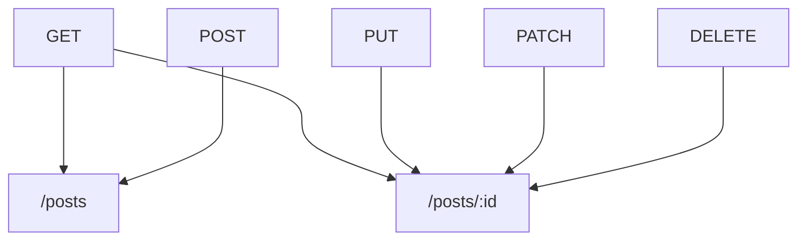

> officially deployed at https://httpmock.org

## Install

```shell
> npm i httpmock.org --g

```

## Usage

Create a `db.json`、`db.json5` or `db.js` file:

```json
{
	"posts":[
		{
	    "userId": 1,
	    "id": 1,
	    "title": "sunt aut facere repellat provident",
	    "body": "quia et suscipit suscipit recusandae consequuntur expedita et cum reprehenderit"
	  },
	  {
	    "userId": 1,
	    "id": 2,
	    "title": "qui est esse",
	    "body": "est rerum tempore vitae sequi sint nihil reprehenderit dolor beatae"
	  }
	],
	"users":[
		{
	    "id": 1,
	    "name": "Leanne Graham",
	    "username": "Bret",
	    "email": "Sincere@april.biz"
	  }
	],
	"todos":[
		{
	    "userId": 1,
	    "id": 1,
	    "title": "delectus aut autem",
	    "completed": false
	  },
	  {
	    "userId": 1,
	    "id": 2,
	    "title": "quis ut nam facilis et officia qui",
	    "completed": false
	  }
	]
}

```

<details>
<summary>view json5 format</summary>

```json5
{
	posts:[
		{
	    userId: 1,
	    id: 1,
	    title: "sunt aut facere repellat provident",
	    body: "quia et suscipit suscipit recusandae consequuntur expedita et cum reprehenderit"
	  },
	  {
	    userId: 1,
	    id: 2,
	    title: "qui est esse",
	    body: "est rerum tempore vitae sequi sint nihil reprehenderit dolor beatae"
	  }
	],
	users:[
		{
	    id: 1,
	    name: "Leanne Graham",
	    username: "Bret",
	    email: "Sincere@april.biz"
	  }
	],
	todos:[
		{
	    userId: 1,
	    id: 1,
	    title: "delectus aut autem",
	    completed: false
	  },
	  {
	    userId": 1,
	    id": 2,
	    title: "quis ut nam facilis et officia qui",
	    completed: false
	  }
	]
}
```
</details>

<details>
<summary>view js format</summary>

```js
export default {
		posts:[
		{
	    userId: 1,
	    id: 1,
	    title: "sunt aut facere repellat provident",
	    body: "quia et suscipit suscipit recusandae consequuntur expedita et cum reprehenderit"
	  },
	  {
	    userId: 1,
	    id: 2,
	    title: "qui est esse",
	    body: "est rerum tempore vitae sequi sint nihil reprehenderit dolor beatae"
	  }
	],
	users:[
		{
	    id: 1,
	    name: "Leanne Graham",
	    username: "Bret",
	    email: "Sincere@april.biz"
	  }
	],
	todos:[
		{
	    userId: 1,
	    id: 1,
	    title: "delectus aut autem",
	    completed: false
	  },
	  {
	    userId": 1,
	    id": 2,
	    title: "quis ut nam facilis et officia qui",
	    completed: false
	  }
	]
}
```
</details>

```shell
> httpmock db.json

# npx
> npx httpmock db.json

```

Based on the example db.json, you'll get the following routes:



URL params:

- Conditions: `eq`、`lt`、`lte`、`gt`、`gte` and `ne`

- Range: `start`、`end` and `limit`

- Paginate: `page` and `per_page`(default = 10)

- Sort: `sort` and `reverse`

- Nested and array fields: `x.y.z` and `x.y.z[i]`

- Embed

## Configuration

